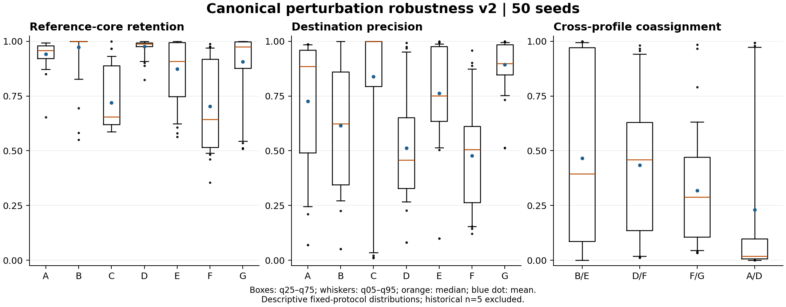
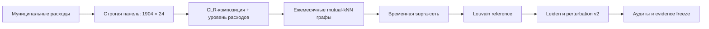

# Сетевая структура локального безналичного потребительского спроса

*Network Structure of Local Cashless Consumer Demand across Russian Municipalities*

Анализ 1904 муниципальных образований России за 24 месяца с использованием атрибутированных сетей, temporal community detection, пространственных контролей и многоуровневой проверки устойчивости результатов.

[](https://github.com/resarytrew/cashless-demand-network-russia/actions/workflows/verify.yml)
[](outputs/evidence_freeze_v2_2_0/README.md)
[](pyproject.toml)

**1904 территории · январь 2023 — декабрь 2024 · 45 696 узлов муниципалитет–месяц · 50 perturbation runs**

[Результаты](#основные-результаты) · [Метод](#метод) · [Evidence freeze](#доказательная-база-и-её-границы) · [Воспроизводимость](#быстрый-старт)

## Исследовательский вопрос

Какие профили локального безналичного потребительского спроса проявляются в муниципальных данных, как они организованы в сети и насколько их ядра и границы сохраняются при изменении алгоритма, параметров и входного графа?

Проект объединяет композиционное представление расходов, сети сходства и временные связи. Главный результат — измеренная устойчивость структуры вместе с её ограничениями. Обнаруженные сообщества не интерпретируются как универсальные «типы экономики».

## Основные результаты

| Проверка | Full-supra ARI к reference | ARI декабря 2024 |
|---|---:|---:|
| Точное воспроизведение Louvain baseline | 1,0000 | 1,0000 |
| Leiden на идентичном графе | 0,4403 | 0,7075 |
| Canonical perturbation v2, среднее 50 runs | 0,4984 | 0,6757 |

**Сохранение ядра не означает устойчивость точной границы.** Например, у профиля D средний retention составляет 0,9758, но precision — 0,5117: участники ядра часто оказываются внутри более крупного сообщества. Для F эти показатели равны 0,7028 и 0,4768. Cross-coassignment B/E меняется от 0 до 1 между runs.



*Распределения описывают конкретный протокол возмущений. Это не доверительные интервалы для генеральной совокупности муниципалитетов.*

- [Leiden: результаты и интерпретация](outputs/leiden_robustness/LEIDEN_FINDINGS.md)
- [Canonical perturbation robustness v2, n=50](outputs/perturbation_v2/PERTURBATION_HIGHREP_FINDINGS.md)
- [Каноническая evidence matrix v2.2.0](outputs/evidence_freeze_v2_2_0/MASTER_PROFILE_EVIDENCE_MATRIX_v2.2.0.csv)
- [Неизменённый реестр научных статусов A–G](outputs/evidence_freeze_v2_2_0/SCIENTIFIC_STATUS_REGISTRY_UNCHANGED.csv)

## Метод



| Компонент | Reference specification |
|---|---|
| Состав расходов | Продовольствие, здоровье, общепит, маркетплейсы, транспорт и остаток `Other` |
| Композиция | CLR / Aitchison geometry |
| Уровень расходов | `log(Total)`, месячный robust-z по median / MAD |
| Веса блоков | 0,70 композиция / 0,30 уровень; нормировка медианными расстояниями |
| Ежемесячный граф | Взвешенный неориентированный mutual-kNN, k=20, adaptive RBF |
| Временная связь | omega=2 × глобальная медиана внутрислойных весов |
| Reference partition | Louvain, resolution=0,5, seed=0 |
| Изоляты | Fallback включён только в отдельном статическом графе декабря |

Параметры заданы в [baseline.yaml](configs/baseline.yaml). Это reference specification; её оптимальность не заявляется. Отдельное статическое разбиение декабря и декабрьский срез временной сети — разные объекты анализа.

В protocol v2 удаляется 5% внутрислойных рёбер, оставшиеся веса умножаются на `exp(N(0, 0.02))`, временные рёбра сохраняются. До генерации случайных чисел рёбра канонически сортируются. Проверены совпадение checksums внутри процесса, в fresh process и после перестановки insertion order. Каждый seed имеет raw labels, hashes и checkpoint.

[Методология](docs/methodology.md) · [Протокол v2](docs/PERTURBATION_V2_PROTOCOL.md) · [Исследовательский контекст](docs/RESEARCH_STATE.md)

## Доказательная база и её границы

Канонический пакет расположен в **[outputs/evidence_freeze_v2_2_0](outputs/evidence_freeze_v2_2_0/README.md)**. При forensic freeze прошли 3748 численных сравнений по сохранённым raw partitions; инвентарь фиксирует SHA256 390 файлов. Сам freeze не является повторным запуском clustering.

- **Допущенная численная evidence:** показатели Leiden и 50 runs protocol v2, проверенные по сохранённым меткам.
- **Исторический perturbation n=5:** `SUPERSEDED_NON_REPRODUCIBLE`; файлы сохранены, но не используются количественно. [Решение по provenance](docs/PERTURBATION_PILOT_PROVENANCE_RESOLUTION.md).
- **S_Dbw:** forensic audit воспроизвёл undefined для всех 50 строк Round 14. Происхождение старых конечных значений не установлено; они исключены из канонической численной evidence. [Аудит](outputs/evidence_freeze_v2_2_0/S_DBW_FORENSIC_AUDIT.md).
- **Пространственные, административные и population/density controls:** описаны в исследовательском контексте. Полный набор исторических внешних артефактов отсутствует в данной поставке; эти результаты не представлены как заново воспроизведённые поля канонической матрицы.
- **Статусы A–G:** сохранены как отдельные научные аннотации. Наличие файла в freeze inventory само по себе не означает допуск его содержимого в evidence.

Строгая панель не установлена как репрезентативная выборка всех муниципалитетов России. `Other` — технический остаток, а не самостоятельная отрасль. Анализ исследовательский: ни причинные эффекты, ни универсальные архетипы, ни независимая внешняя валидация через mobility не заявляются.

[Правила evidence](docs/evidence_governance.md) · [Реестр claims](docs/HYPOTHESIS_LEDGER.md) · [Допуск и исключения](outputs/evidence_freeze_v2_2_0/EVIDENCE_ADMISSIBILITY.csv)

## Быстрый старт

Для среды, близкой к зафиксированному запуску, используйте Python 3.13; исторические вычисления выполнены на Python 3.13.6 / Windows. Полные версии пакетов сохранены в [environment_versions.json](outputs/evidence_v2_2_0/environment_versions.json).

```bash
git clone https://github.com/resarytrew/cashless-demand-network-russia.git
cd cashless-demand-network-russia
python -m venv .venv
```

Активация: `.venv\Scripts\Activate.ps1` в PowerShell или `source .venv/bin/activate` в macOS/Linux.

```bash
python -m pip install -r outputs/evidence_v2_2_0/requirements-used.txt
python -m pip install -e . --no-deps
python -m pytest -q
python scripts/canonical_evidence_freeze.py verify
```

Для тестов, импортирующих forensic scripts, при необходимости задайте `PYTHONPATH`: `$env:PYTHONPATH = 'src;.'` в PowerShell или `export PYTHONPATH=src:.` в macOS/Linux.

Последняя локальная проверка: **26 tests passed**. Проверка freeze читает файлы и сверяет hashes; новые эксперименты не запускаются.

### Новый запуск без перезаписи evidence

```bash
python -m sbernet.robustness.reproduction_gate --output outputs/reproducibility_gates/new_attempt
```

Команда создаёт новую папку и требует точного совпадения reference labels. Не запускайте baseline pipeline с записью в замороженный `outputs/baseline`. Каждый новый эксперимент должен иметь отдельный конфиг и output; завершённые seeds не пересчитываются без явного `--force`.

[Подробные команды и resume](docs/ROBUSTNESS_V2_COMMANDS.md)

## Состав репозитория

| Каталог | Содержание |
|---|---|
| `src/sbernet/` | Подготовка панели, признаки, графы, временная модель, robustness |
| `configs/` | Reference и отдельные спецификации экспериментов |
| `data/raw/` | Архивы расходов и mobility, использованные в анализе |
| `outputs/` | Метки, raw results, checkpoints, аудиты и версии evidence |
| `outputs/evidence_freeze_v2_2_0/` | Каноническая матрица, forensic audit, freeze manifest |
| `docs/` | Методология, контекст, provenance и научные ограничения |
| `reference/` | Сохранённый исторический runner |
| `scripts/` | Построение отчётов, forensic replay и проверка freeze |
| `tests/` | Проверки метрик, детерминизма, схем и целостности |

Исходные муниципальные данные — SberIndex; преобразования и состав панели описаны в документации. Права на сторонние данные не переопределяются этим репозиторием. Условия повторного использования следует проверять у источника данных.

Исторические manifests с `git_commit=null` сохранены без изменений: они созданы до помещения рабочей копии под Git. Git-история публикации и побайтовые SHA256-манифесты выполняют разные функции provenance.

## Как ссылаться на результаты

Указывайте название проекта, URL репозитория, конкретный Git commit и evidence version **2.2.0 / canonical_forensic_1**. Для отдельного результата добавляйте путь к его CSV и соответствующему audit. Авторы и DOI не подставляются автоматически: эти сведения должны соответствовать фактическому авторству и публикации.
