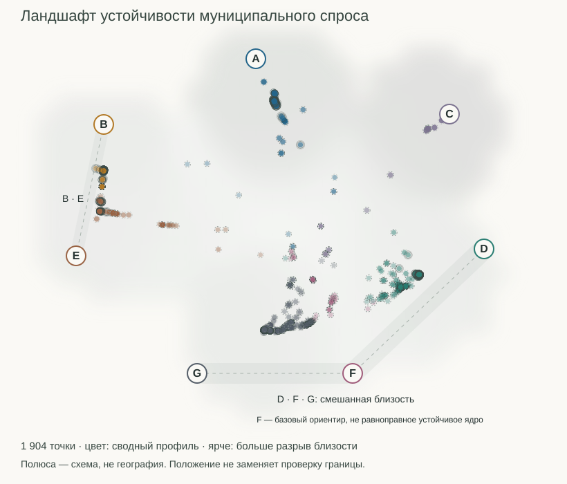

# Профили локального безналичного спроса России

### Сетевая кластеризация 1 904 муниципалитетов · динамика 2023–2024 · независимая социально-экономическая проверка

[](https://github.com/resarytrew/cashless-demand-network-russia/actions/workflows/presubmission-verify.yml)
[](https://github.com/resarytrew/cashless-demand-network-russia/actions/workflows/verify.yml)

> **Главный результат:** в данных СберИндекса обнаруживается воспроизводимая структура локального безналичного потребительского спроса с устойчивыми ядрами, чувствительными границами и переходными областями.

> **Независимая ось чувствительности:** при изменении временной связи профиль изменился только у **1 из 824** муниципалитетов устойчивого ядра, но у **348 из 388** переходных территорий. Omega-вариация не входила в построение Atlas states.

---

## Основные выводы исследования

> **Ключевая идея.** Россию можно исследовать не только через административные границы и расстояния, но и через сходство локальных моделей безналичного потребительского спроса.

### 01 — Скрытая карта потребительского спроса

Муниципалитеты образуют сеть сходства по структуре и уровню наблюдаемого безналичного спроса. Две территории могут быть удалены на географической карте, но оказаться близкими по потребительскому поведению.

Атлас помогает поставить практический исследовательский вопрос:

> На какие другие муниципалитеты этот рынок похож по структуре потребительского спроса?

### 02 — Семь ориентиров сравнения

В reference-анализе выделены семь обозначенных профилей локального спроса A–G. Это не шкала «богатых» и «бедных» территорий и не универсальная типология экономики. Профили описывают сочетания интенсивности спроса, структуры расходов и её динамики во времени.

Например, профиль A характеризуется высокой интенсивностью спроса и большей концентрацией потребительской активности в наблюдаемых категориях. Профиль G описывает другую структуру расходов. Полные названия и ограничения интерпретации приведены в [результатах](docs/RESULTS.md).

### 03 — У ядер есть границы

Часть территорий сохраняет близость к одному профилю при проверках и образует устойчивые ядра. Другие располагаются между несколькими профилями: для них граница назначения чувствительнее к способу анализа.

Это важная часть результата: карта спроса не сводится к жёсткому делению страны на изолированные группы. Атлас показывает и профиль, и степень определённости этого описания.

### 04 — Внешние показатели дают независимый контекст

Население, заработная плата и занятость **не использовались** при построении сети и профилей. Их добавили после фиксации меток как независимое описательное сопоставление.

По этим данным между профилями наблюдаются статистические различия. Для заработной платы размер эффекта составляет **ε² = 0,633**. Это согласуется с тем, что профили спроса связаны с различиями в экономическом контексте территорий; причинную связь такой результат не устанавливает.

### 05 — Похожие рынки не обязаны быть рядом

Обычное сравнение территорий начинается с региона, расстояния и численности населения. Атлас добавляет ещё один ракурс — похожесть структуры спроса.

Для бизнеса это инструмент первичного анализа: вместо поиска «похожего города рядом» можно отобрать территории с похожей моделью спроса для дальнейшего исследования. Такой отбор формирует гипотезу, но не гарантирует успех конкретного продукта или экономический рост.

### 06 — Важна не только метка, но и её устойчивость

Атлас различает территории с устойчивым окружением и территории, где сходство распределено между несколькими профилями. Поэтому он отвечает не только на вопрос «к какому профилю относится территория», но и показывает, насколько однозначно следует трактовать это сходство.

### 07 — Независимые данные не входят в модель, но помогают её читать

После построения профилей мы сопоставили их с населением, заработной платой, занятостью и отраслевыми показателями. Эти данные не участвовали в формировании сети. Наблюдаемые различия дают независимый контекст для интерпретации профилей, а их покрытие, метод и ограничения подробно зафиксированы в [разделе результатов](docs/RESULTS.md).

### Общий вывод

**Атлас локального спроса России — инструмент для исследования скрытой структуры потребительского поведения страны.** Он показывает, какие территории похожи по модели спроса, насколько устойчиво это сходство и где структура меняется или требует осторожной интерпретации.

---

Типология строится **только по данным о потребительском спросе СберИндекса**.
Население, зарплата и структура занятости подключаются уже после фиксации кластеров — как независимая проверка их экономического смысла.

**1 904 муниципалитета · 24 месяца · 45 696 наблюдений «муниципалитет × месяц»**

| Независимая проверка | Покрытие |
|---|---:|
| Население | **1 903 МО** |
| Зарплата | **1 890 МО** |
| Занятость | **1 890 МО** |
| Занятость по ОКВЭД | **1 888 МО** |

Крупнейшие различия между профилями:

**зарплата ε² = .633 · занятость ε² = .516 · население ε² = .468**

По независимой социально-экономической статистике можно частично восстановить найденный профиль спроса:

**Random Forest: macro-F1 = .647**
**случайная перестановка меток: macro-F1 ≈ .091**

После исключения целых регионов из обучения сигнал сохраняется:

**macro-F1 = .551** против **регионального базового уровня .096**

### [Открыть интерактивный Атлас устойчивости →](https://resarytrew.github.io/cashless-demand-network-russia/)

[Методология](docs/METHODOLOGY.md) · [Результаты](docs/RESULTS.md) · [Техническое приложение](docs/TECHNICAL_APPENDIX.md) · [Итоговый аудит](outputs/final_competition_upgrade/FINAL_SUBMISSION_AUDIT.md)

---

## Главное за 30 секунд

Исследование отвечает на три вопроса:

1. **Есть ли среди муниципалитетов повторяющиеся структуры безналичного спроса?**
2. **Насколько найденные группы сохраняются во времени и при изменении методики?**
3. **Имеют ли они независимый социально-экономический смысл?**

Ответ — да, но с важным уточнением.

Мы видим не семь одинаково жёстких типов, а сочетание:

- устойчивых ядер;
- чувствительных границ;
- переходных территорий;
- профилей с разной степенью подтверждения.

Поэтому итог проекта — не просто карта кластеров, а **карта уверенности в структуре спроса**.

---

# Как работа закрывает критерии конкурса

| Критерий | Вес | Что сделано |
|---|---:|---|
| **Методология** | **15%** | Раздельно моделируются структура и уровень спроса; все ключевые допущения и ограничения явно зафиксированы |
| **Атрибутированная сеть** | **15%** | Ежемесячная сеть взаимных ближайших соседей, адаптивные веса связей, отдельная проверка правил построения рёбер |
| **Динамика** | **15%** | Единая временная сеть на 24 месяца, анализ влияния временной связи и синтетическая проверка с известной истинной структурой |
| **ICVI** | **15%** | Для фиксированных разбиений рассчитаны SW, CH, S_Dbw, weighted AVI/AVU, ANUI, TurboMQ и отдельный Newman–Girvan Q |
| **Интерпретация и воспроизводимость** | **30%** | Почти национальная независимая проверка, анализ D–F–G, региональная переносимость, 96 автоматических тестов, воспроизводимость базового результата |
| **Визуализация** | **10%** | Интерактивный Атлас устойчивости показывает не только кластер, но и степень уверенности, переходность и близость к другим профилям |

---

# 1. Данные

Основной источник — муниципальные показатели безналичных потребительских расходов СберИндекса.

После строгой проверки полноты используется панель:

| Показатель | Значение |
|---|---:|
| Муниципалитеты | **1 904** |
| Период | январь 2023 — декабрь 2024 |
| Месяцы | **24** |
| Наблюдения | **45 696** |
| Категории спроса | 5 опубликованных категорий + общий показатель |

В модели используются:

- продовольствие;
- здоровье;
- общественное питание;
- маркетплейсы;
- транспорт;
- общий показатель расходов `Total`.

Полнота панели **не означает автоматически репрезентативность всей России**. Это ограничение сохраняется в итоговой интерпретации.

---

# 2. Как представляются признаки

Для каждого муниципалитета учитываются две разные характеристики.

### Структура спроса

Нас интересует не только общий уровень расходов, но и соотношение категорий между собой.

В базовом варианте используются пять опубликованных категорий и технический остаток `Other`, после чего применяется CLR-преобразование композиционных данных.

### Уровень спроса

Отдельно учитывается логарифм общего показателя `Total`, нормированный внутри каждого месяца устойчивой к выбросам процедурой.

В итоговом расстоянии:

\[
d^2 =
0.70\,d^2_{\text{структура}}
+
0.30\,d^2_{\text{уровень}}
\]

Соотношение **70/30** — заранее зафиксированная настройка, а не результат подбора по максимальному качеству кластеризации.

---

## Проверка без технического остатка `Other`

Аддитивность `Total` и пяти опубликованных категорий не подтверждена метаданными. Поэтому отдельно проверено, что произойдёт, если вообще отказаться от вычисляемого `Other`.

| Представление признаков | ARI к базовому результату | NMI |
|---|---:|---:|
| Базовый вариант | 1.000 | 1.000 |
| CLR только пяти опубликованных категорий | **.822** | **.764** |
| Логарифмы пяти наблюдаемых уровней | **.708** | **.649** |

**Вывод:** крупная структура сохраняется, но точные границы профилей зависят от способа представления данных.

Это отрицательный результат проверки устойчивости, и он намеренно не скрывается.

---

# 3. Как строится сеть

Для каждого месяца муниципалитеты сравниваются в пространстве признаков.

Пара соединяется ребром только тогда, когда **оба муниципалитета входят в число 20 ближайших соседей друг друга**.

Это взаимный граф ближайших соседей — `mutual-kNN`.

Для пары \(i,j\):

\[
w_{ij}
=
\exp
\left(
-\frac{d_{ij}^{2}}
{\sigma_i\sigma_j+\varepsilon}
\right)
\]

где \(\sigma_i\) — расстояние до 20-го ближайшего соседа муниципалитета.

Такое взвешивание адаптируется к локальной плотности данных: одинаковое абсолютное расстояние может означать разную степень сходства в плотной и разреженной областях пространства признаков.

---

## Насколько результат зависит от правила построения рёбер

Мы отдельно сравнили базовый взаимный граф с более плотным вариантом, где достаточно одностороннего соседства.

Для декабря 2024 года при `k=20`:

| Правило | Рёбра | Сообщества | ARI к базовому разбиению |
|---|---:|---:|---:|
| Взаимные ближайшие соседи | **11 787** | 9 | 1.000 |
| Объединение соседств | **26 305** | 6 | **.553** |

Более плотная сеть заметно меняет разбиение.

**Следствие:** способ определения локального соседства — содержательная часть модели, а не безразличная техническая деталь.

[Полный анализ чувствительности →](outputs/final_competition_upgrade/edge_sensitivity_v3/EDGE_SENSITIVITY.md)

---

# 4. Динамика за 24 месяца

Муниципалитеты не кластеризуются отдельно в каждом месяце.

Каждый узел `(муниципалитет, месяц)` имеет:

- связи с похожими муниципалитетами в этом же месяце;
- связь с самим собой в соседнем месяце.

Получается единая временная сеть.

Вес межмесячной связи:

\[
w_T
=
\omega
\cdot
median(w_{\text{внутри месяца}})
\]

В базовой конфигурации:

\[
\omega=2
\]

Алгоритм Louvain применяется ко всей расширенной сети сразу.

---

## Почему нельзя просто сказать «85,3% муниципалитетов стабильны»

При \(\omega=2\):

**85,3% муниципалитетов имеют не более двух смен метки за 24 месяца.**

Но результат сильно зависит от силы временной связи:

| \(\omega\) | Доля МО с ≤2 сменами |
|---:|---:|
| .25 | **≈0,05%** |
| 2 | **85,3%** |
| 4 | **88,8%** |

Round21 показывает, что переход `ω=2 → 1` — преимущественно огрубление, но не
полная иерархическая вложенность:

| Диагностика декабря | Значение |
|---|---:|
| ARI / NMI | **0,407 / 0,555** |
| Число сообществ | **10 → 7** |
| Fine-to-coarse micro purity | **0,978** |
| Fine-pair retention | **0,983** |
| Coarse-pair precision | **0,489** |
| H(ω1\|ω2) / H(ω2\|ω1), бит | **0,130 / 1,287** |

При diagnostic matched-K (`ω=1`, resolution=0,8, K=10) B/E остаются
объединёнными, но совместное C/D/F/G-слияние распадается. Поэтому часть
результата связана с взаимодействием `ω × resolution`; `ω=2` остаётся reference,
а не объявляется оптимальным.

Поэтому редкие смены — это одновременно:

- сходство самих данных;
- эффект временного сглаживания модели.

Мы не трактуем их как прямое доказательство экономической стабильности территории.

---

# 5. Синтетическая проверка временной модели

Чтобы не выбирать параметр \(\omega\) по российским данным, проведён отдельный моделируемый эксперимент, где истинная структура заранее известна.

Проверено шесть сценариев:

- стабильная структура;
- резкая настоящая смена;
- постепенный переход;
- территория на границе двух групп;
- временный шок без настоящей смены;
- смешанный сценарий.

В смешанном сценарии роли не пересекаются:

**10% настоящих переходов · 10% пограничных территорий · 10% временных шоков · 70% стабильных**

Для каждого сценария выполнено 20 независимых запусков.

Проверялась сетка:

\[
\omega \in
\{0,\ .25,\ .5,\ 1,\ 2,\ 4\}
\]

Корректирующий benchmark v4 оценивает качество разбиения помесячно. Старый
flattened ARI сохранён только как диагностическая legacy-метрика: при независимой
кластеризации месяцев он смешивает качество разбиения с произвольной нумерацией
кластеров между месяцами.

| \(\omega\) | Mean monthly ARI | F1 переходов (сценарии с переходами) | False-switch rate без переходов |
|---:|---:|---:|---:|
| 0 | .880 | .520 | .0401 |
| .25 | .863 | .455 | .0816 |
| .5 | .880 | .470 | .0567 |
| 1 | .893 | .498 | .0332 |
| 2 | .897 | .388 | .0055 |
| 4 | .912 | .275 | .0032 |

**Единственного универсального значения нет.** Сильная временная связь лучше
подавляет ложные колебания и повышает среднее качество месячных разбиений, но
одновременно снижает полноту обнаружения настоящих переходов и увеличивает задержку.
Для сценариев с переходами и без них используются разные описательные utility;
они не объединяются в один рейтинг.

В mixed-сценарии при reference \(\omega=2\): mean monthly ARI=.812,
node-state accuracy=.942, switch F1=.246 и средняя абсолютная задержка=.696 месяца.
Высокая точность текущего состояния не означает столь же высокое качество
обнаружения события перехода.

\(\omega=2\) остаётся заранее зафиксированной reference specification реального
исследования; v4 не выбирает и не ретюнингует её.

[Подробный отчёт v4 →](outputs/final_competition_upgrade/synthetic_temporal_v4/SYNTHETIC_TEMPORAL_REPORT.md)

---

# 6. Внутренние показатели качества кластеризации

Для базового статического разбиения декабря 2024 рассчитан полный набор требуемых конкурсом ICVI.

| Метрика | Значение | Интерпретация |
|---|---:|---|
| SW | **.170** | выше лучше |
| CH | **875.215** | выше лучше |
| CH / N | **.460** | вспомогательный масштаб |
| S_Dbw | **.829** | ниже лучше |
| AVI | **.916** | выше лучше |
| AVU | **.505** | ниже лучше |
| ANUI | **.626** | выше лучше |
| MQ | **8.245** | выше лучше |
| Q | **.767** | выше лучше |

Эти показатели оценивают **уже заданные разбиения**. MQ обозначает TurboMQ; Q обозначает weighted Newman–Girvan modularity. Это разные шкалы, их значения нельзя сравнивать напрямую.

Мы не использовали ICVI для выбора наиболее выгодного алгоритма, числа кластеров или представления признаков задним числом.

[Определения ICVI →](docs/ICVI.md) · [Отчёт ICVI v2 →](outputs/final_competition_upgrade/icvi_v2/ICVI_REPORT.md) · [Каноническая таблица →](outputs/final_competition_upgrade/icvi_v2/canonical_icvi_v2.csv)

---

# 6.1. Две аналитические линзы

**L1** остаётся reference: спрос-only → temporal network → A–G → независимая внешняя интерпретация.

**L2** рассчитана отдельно на 1 876 complete-case МО: L1 + log(population) + log(wage) + market access + CLR структуры занятости. Параметры сравнения сохранены (`k=20`, `omega=2`, resolution=.5), но L2 не заменяет baseline и не использует заранее заданное число типов.

| Диагностика | Результат |
|---|---:|
| L1/L2 ARI | .432 |
| L1/L2 NMI | .472 |
| Крупные L2-профили (≥2%) | 5 |
| Их совокупное покрытие | 95.3% |
| Rule-tree CV balanced accuracy | .845 |
| Независимый mobility hold-out | 268 / 1 876 |

Population, wage, employment structure и market access больше не являются независимой проверкой L2, потому что входят в её признаки. Mobility не входила в модель, но её покрытие селективно. Полный temporal December результат содержит 41 сообщество и отрицательный silhouette, поэтому пять крупных профилей — описательные, а не «пять доказанных универсальных типов».

В исходной L2 глобальные вклады squared distance сопоставимы для спроса
(34,08%) и занятости (34,54%), но на рёбрах employment — крупнейший блок
(52,05%). Две заранее заданные block-balanced sensitivity дали ARI к исходной
L2 **0,035** и **0,177** (edge Jaccard около 0,43). L2 материально зависит от
block geometry; ни один balanced-вариант не выбран.

[Отчёт L2 →](outputs/round19_dual_lens_l2/DUAL_LENS_L2_REPORT.md) · [Round21 →](outputs/round21_structural_sensitivity/ROUND21_REPORT.md) · [Evidence v2.8.0 →](outputs/evidence_v2_8_0/ROUND21_EVIDENCE_UPDATE.md)

---

# 7. Семь основных профилей

Для интерпретации используются семь крупных профилей A–G.

Но они имеют разную степень подтверждения.

| Код | Название | Legacy status | ω=1 destination / retention | Внешняя поддержка |
|---|---|---|---:|---|
| **A** | Высокоинтенсивный профиль спроса | overlapping candidate | 13 / 92,9% | adjusted global |
| **B** | Высокоинтенсивный внутригородской профиль | federal-intracity subtype | 16 / 100% | B/E различимы post-hoc |
| **C** | Низкоинтенсивный неопределённый профиль | rejected standalone | 15 / 96,6% | unresolved |
| **D** | Средне-высокоинтенсивный профиль спроса | boundary caveat | 15 / 98,7% | D/F/G различимы post-hoc |
| **E** | Повышенно-интенсивный профиль спроса | contextual candidate | 16 / 94,6% | B/E различимы post-hoc |
| **F** | Переходный среднеинтенсивный профиль | boundary population | 15 / 95,7% | D/F/G различимы post-hoc |
| **G** | Широкий низкоинтенсивный профиль | broad macroprofile | 15 / 99,8% | D/F/G различимы post-hoc |

Мы сознательно не превращаем каждый кластер в красивую экономическую историю.

Если доказательств недостаточно, профиль остаётся **предварительным** или **неразрешённым**.

[Почему профили получили именно такие названия →](docs/PROFILE_NAMING_AUDIT.md)

---

# 8. Независимая социально-экономическая проверка

Это центральная проверка экономического смысла результата.

Сначала были полностью зафиксированы профили A–G.

Только после этого выполнено независимое сопоставление:

```text
данные спроса СберИндекса
        ↓
зафиксированные профили A–G
        ↓
официальный territory_id
        ↓
ОКТМО
        ↓
муниципальная статистика
```

Население, зарплата и структура занятости **не участвуют**:

- в построении признаков;
- в построении сети;
- в кластеризации;
- в выборе профилей.

Они используются только после завершения кластеризации.

---

## Покрытие внешних данных

| Показатель | Совпавшие МО | Покрытие |
|---|---:|---:|
| Население | **1 903** | **100%** |
| Зарплата | **1 890** | **99,32%** |
| Общая занятость | **1 890** | **99,32%** |
| Занятость по отраслям | **1 888** | **99,21%** |

Инвестиции имеют около 1% покрытия и поэтому **не используются в центральной национальной проверке**.

---

## Насколько различаются профили

Для независимых социально-экономических показателей:

\[
\varepsilon^2_{\text{зарплата}}=.633
\]

\[
\varepsilon^2_{\text{занятость}}=.516
\]

\[
\varepsilon^2_{\text{население}}=.468
\]

Для отраслевой структуры занятости:

**псевдо-F = 62,36 · p = .001**

Таким образом, профили, найденные исключительно по безналичному спросу, имеют заметно разные внешние социально-экономические характеристики.

После контроля `log(population)` и фиксированных эффектов региона добавочная
объясняющая способность A–G сохраняется:

| Внешний блок | Partial R² | Robust / permutation check |
|---|---:|---:|
| log(wage) | **0,176** | HC3 p < 10⁻¹⁰; Freedman–Lane p=0,0005 |
| log(employment total) | **0,214** | HC3 p < 10⁻¹⁰; Freedman–Lane p=0,0005 |
| sector CLR, 15 измерений | **0,036** | pseudo-F=11,239; p=0,0005 |

Это наблюдательные ассоциации. Малый sector partial R² нельзя превращать в
сильный причинный или универсальный экономический вывод.

Это **независимая ассоциативная проверка**, а не доказательство существования «истинных типов экономики».

[Национальная внешняя проверка →](outputs/final_competition_upgrade/external_validation_national_20261006_r6/NATIONAL_EXTERNAL_VALIDATION.md)

---

# 9. Можно ли определить профиль только по независимой статистике

Дополнительно поставлен обратный вопрос:

> Если скрыть данные СберИндекса и оставить только население, зарплату, занятость и отраслевую структуру — насколько хорошо можно восстановить найденный профиль?

| Модель | Macro-F1 | Сбалансированная точность |
|---|---:|---:|
| Мультиномиальная логистическая регрессия | **.592** | **.670** |
| Случайный лес | **.647** | **.632** |
| Случайно переставленные метки | **≈.091** | **≈.151** |

Независимая статистика содержит значительно больше информации о найденной типологии, чем случайный уровень.

Эти модели **не используются для изменения кластеров**.

---

# 10. Проверка влияния географии

Социально-экономические показатели сильно зависят от региона, поэтому дополнительно проверено:

> Не объясняются ли различия между профилями просто принадлежностью к субъекту РФ?

В групповой перекрёстной проверке целые регионы полностью исключаются из обучения.

| Модель | Macro-F1 при исключении регионов |
|---|---:|
| Логистическая регрессия | **.549** |
| Случайный лес | **.551** |
| Базовый вариант только по региону | **.096** |

Сигнал уменьшается относительно обычной перекрёстной проверки, но остаётся заметно выше регионального базового уровня.

После центрирования показателей внутри каждого субъекта различия также сохраняются:

\[
\varepsilon^2_{\text{население}}=.240
\]

\[
\varepsilon^2_{\text{зарплата}}=.159
\]

\[
\varepsilon^2_{\text{занятость}}=.255
\]

**Вывод:** география объясняет часть различий, но не сводит к себе всю найденную структуру.

---

# 11. Почему профиль F считается переходным

Внутренние проверки устойчивости показывают, что территории F часто оказываются ближе либо к D, либо к G.

Независимая статистика даёт тот же порядок:

\[
D > F > G
\]

по:

- зарплате;
- численности населения;
- занятости.

Для отраслевой структуры F занимает промежуточное положение между D и G по **10 из 15** агрегированных компонентов.

Это поддерживает переходную интерпретацию F.

Но мы не утверждаем, что между D, F и G существует жёсткая экономическая граница.

---

# 12. Атлас устойчивости

Обычная кластерная карта отвечает только на вопрос:

> «К какой группе относится муниципалитет?»

**Атлас устойчивости** отвечает ещё на несколько:

- насколько устойчиво это отнесение;
- сохраняется ли окружение территории при изменении методики;
- насколько определённа граница профиля;
- близка ли территория сразу к нескольким профилям;
- менялась ли её принадлежность во времени.

Для каждой территории рассчитываются:

- сохранение окружения;
- точность и Jaccard границы;
- близость к профилям;
- отрыв первого профиля от второго;
- энтропия близостей;
- временная траектория.

Используются четыре смысловых состояния:

- **устойчивое ядро**;
- **расширенное ядро**;
- **переходная территория**;
- **неразрешённая территория**.

### [Открыть Атлас устойчивости →](https://resarytrew.github.io/cashless-demand-network-russia/)



---

# 13. Воспроизводимость

Для текущей конкурсной версии:

**96 автоматических тестов проходят успешно.**

Автоматическая проверка финальной версии включает:

- полный запуск `pytest`;
- проверку нового кода статическим анализатором;
- новое воспроизведение базовой модели;
- контроль обязательных итоговых артефактов;
- проверку независимой внешней валидации;
- контроль отсутствия внешних признаков в кластеризации;
- проверку данных для визуализации.

Повторное воспроизведение базового результата даёт:

\[
ARI=NMI=1
\]

для:

- всей временной сети;
- декабря во временной модели;
- статического декабря.

Историческая целостность ранее зафиксированных результатов проверяется отдельным независимым контуром.

**Обе проверки GitHub Actions проходят успешно.**

---

# Быстрый запуск

```bash
python -m pip install -e ".[dev,robustness,validation]"

python -m pytest -q

python scripts/verify_presubmission_current.py
```

Крупные исходные архивы, промежуточные данные и кэши графов намеренно не хранятся в Git.

Для внешних источников сохраняются:

- адрес источника;
- лицензия;
- SHA-256;
- правила обработки;
- воспроизводимая процедура сопоставления муниципалитетов.

---

# Ограничения

Исследование описывает **наблюдаемый безналичный потребительский спрос**, а не всю экономику муниципалитета.

Строгая панель из 1 904 территорий сама по себе не гарантирует национальную репрезентативность.

База нормирования общего показателя `Total` установлена не полностью.

Аддитивность общего показателя и пяти категорий не доказана.

Точные границы кластеров зависят от:

- представления признаков;
- способа построения сети;
- параметров временной связи и её взаимодействия с resolution;
- block weighting в L2.

Синтетическая проверка не может определить единственный универсальный параметр для реальной экономики.

Mobility hold-out имеет селективное покрытие. Balanced-L2 sensitivity не
заменяют original L2. Fixed `ω` остаётся сознательным ограничением.

Внешняя социально-экономическая проверка является наблюдательной и не позволяет делать причинные выводы.

> **Для нас эти ограничения — не сноска мелким шрифтом, а часть результата: устойчивость ядра и уверенность в точной границе — разные свойства.**

---

# Структура проекта

```text
configs/        конфигурации экспериментов
src/sbernet/    признаки, графы, кластеризация, метрики и проверки
scripts/        воспроизводимые расчёты и сборка итоговых данных
tests/          автоматические тесты
docs/           методология, результаты и технические пояснения
outputs/        сохранённые доказательные результаты
```

---

# Навигация

| Раздел | Ссылка |
|---|---|
| Методология | [docs/METHODOLOGY.md](docs/METHODOLOGY.md) |
| Основные результаты | [docs/RESULTS.md](docs/RESULTS.md) |
| Техническое приложение | [docs/TECHNICAL_APPENDIX.md](docs/TECHNICAL_APPENDIX.md) |
| Итоговый аудит | [FINAL_SUBMISSION_AUDIT.md](outputs/final_competition_upgrade/FINAL_SUBMISSION_AUDIT.md) |
| Обоснование названий профилей | [PROFILE_NAMING_AUDIT.md](docs/PROFILE_NAMING_AUDIT.md) |
| Национальная внешняя проверка | [NATIONAL_EXTERNAL_VALIDATION.md](outputs/final_competition_upgrade/external_validation_national_20261006_r6/NATIONAL_EXTERNAL_VALIDATION.md) |
| Синтетическая проверка временной модели | [SYNTHETIC_TEMPORAL_REPORT.md](outputs/final_competition_upgrade/synthetic_temporal_v4/SYNTHETIC_TEMPORAL_REPORT.md) |
| Анализ чувствительности графа | [EDGE_SENSITIVITY.md](outputs/final_competition_upgrade/edge_sensitivity_v3/EDGE_SENSITIVITY.md) |
| Атлас устойчивости | [Открыть](https://resarytrew.github.io/cashless-demand-network-russia/) |

---

## Итог

Мы не пытаемся доказать, что муниципалитеты России делятся на семь жёстких и неизменных типов.

Результат сложнее и содержательнее:

> **В пространстве локального безналичного спроса существуют воспроизводимые профили и устойчивые ядра, но часть территорий образует переходные области. Экономический смысл этой структуры подтверждается независимой муниципальной статистикой, тогда как точные границы и временная устойчивость зависят от выбранной спецификации модели.**
