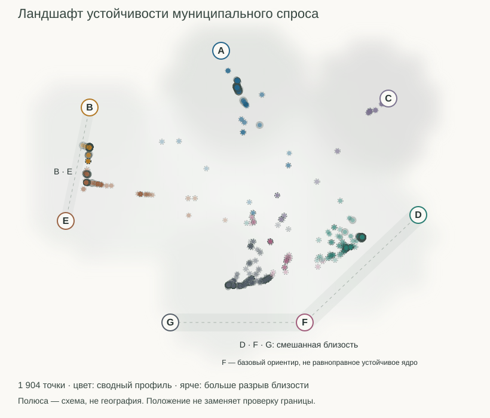
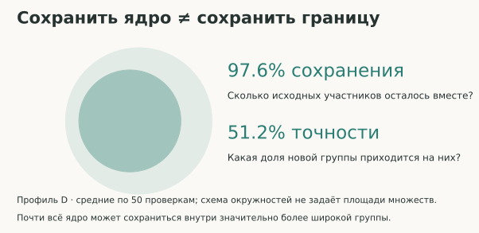
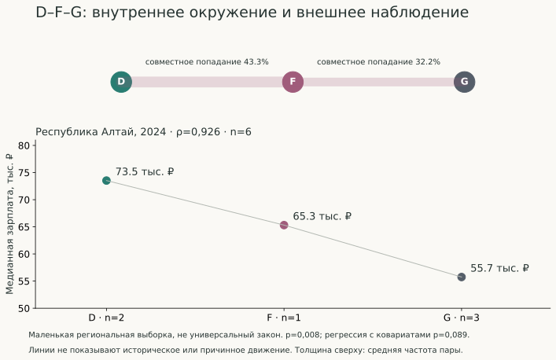
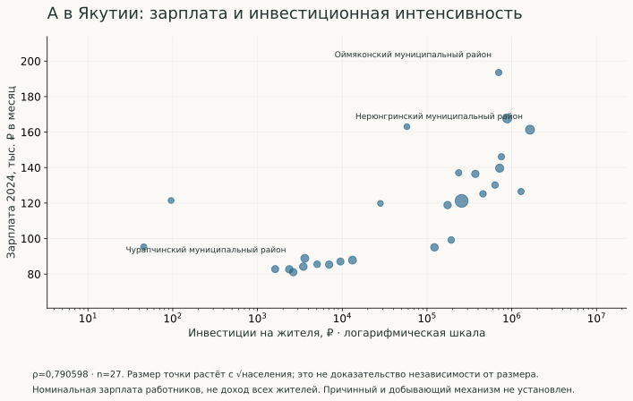

# Визуальные результаты

[Открыть интерактивный ландшафт](https://resarytrew.github.io/cashless-demand-network-russia/) · [Исследование](../README.md)

## 1. Ландшафт устойчивости



**Вопрос:** насколько оправдано назначать каждой территории один фиксированный профиль?

**Изображено:** все 1 904 муниципалитета, включая пять малых технических случаев. Координата — сумма исходных долей близости A–G, умноженных на фиксированные координаты полюсов. Полюса объявлены в YAML до первого построения и не оптимизировались по картинке. Нет UMAP, PCA, t-SNE, подбора координат или новой кластеризации.

Цвет означает сводный профиль. Прозрачность растёт с разрывом двух ведущих долей, радиус — с квадратным корнем ведущей доли. Обводка отдельно показывает категорию устойчивости: тонкая — stable_core, двойная — expansive_core, пунктирная — transition, серая — unresolved. В специальных режимах цвет переключается только на устойчивость или неопределённость; легенда меняется вместе с ним. Подписи A–G, поиск и числовые полосы позволяют обходиться без распознавания цвета.

**Можно заключить:** отдельная базовая метка не передаёт смешанность окружения. D/F/G и B/E имеют внутренние связи, но F не становится равноправным устойчивым ядром только потому, что у него нарисован полюс.

**Нельзя заключить:** координаты не географические и не экономические; двумерная проекция не сохраняет все расстояния и может совмещать разные смеси. Центр не обязательно означает максимальную неопределённость, близость к полюсу не заменяет проверку границ. Доли — не вероятности. B/E не имеют независимого внешнего экономического подтверждения.

Фоновое поле — фиксированное локальное визуальное усреднение `(entropy + 1 − margin)/2`, а не новая статистическая модель: сетка 24 единицы, радиус ядра 38, обрезка 114, минимальная поддержка 0,35. Вне поддержки фон не строится. Светлее означает большую неопределённость. Поле относится ко всей выборке; фильтры его не пересчитывают. Линии коридоров — заранее обозначенные семьи, не оценённые траектории. Реальные облака точек показывают данные, а не заполняют эти линии по замыслу автора.

Жёсткий режим использует условную укладку вокруг базового полюса; смещения не являются данными. Переключение режимов — смена представления, не историческое движение. Рассказ из пяти сцен занимает около 60 секунд, поддерживает паузу, шаги, выход и предпочтение уменьшенного движения. Поиск делает доступными и точки, перекрывающиеся на схеме. Семейные фильтры применяют открытый порог суммы долей ≥0,60.

## 2. Ядро и граница



**Вопрос:** может ли группа сохранить почти всех своих участников и при этом потерять чёткую границу?

**Изображено:** среднее сохранение D ≈97,6% и средняя точность группы назначения ≈51,2% по 50 сохранённым проверкам. Круги поясняют вложенность, но их площади не кодируют реальные множества: две средние доли не позволяют восстановить один конкретный набор пересечений.

**Можно заключить:** сохранение участников и точность границы — разные свойства. **Нельзя заключить:** это не один наблюдаемый переход D и не причинная схема расширения экономики.

## 3. D–F–G: внутреннее окружение и внешняя проверка



**Вопрос:** согласуется ли переходное окружение F с независимым экономическим наблюдением?

**Изображено:** сверху — среднее совместное попадание D/F и F/G в уже сохранённых четырёх семействах проверок с равными весами; толщина = `3 + 25 × частота`, прозрачность фиксирована. Снизу — медианы зарплаты Алтая: D 73 525,45 ₽, F 65 317,70 ₽, G 55 749,40 ₽. Количество территорий 2/1/3. Кодировка G=1, F=2, D=3 даёт положительный ρ≈0,926.

**Можно заключить:** региональное наблюдение согласуется с переходной интерпретацией. **Нельзя заключить:** n=6, F n=1 не устанавливают национальный закон или причинное движение. p≈0,008 — исходная ранговая проверка; p≈0,089 — отдельная регрессия с населением и урбанизацией, не поправка на множественные проверки. Равномерное горизонтальное расположение профилей — схема, не оценённое расстояние.

## 4. A: инвестиции, зарплата и размер территории



**Вопрос:** как соотносятся зарплата и инвестиции внутри якутской подвыборки A?

**Изображено:** 27 наблюдений; X — инвестиции на жителя в логарифмической шкале, Y — номинальная зарплата 2024 года. Площадь маркера = `25 + 180 × sqrt(population/max_population)`; размер лишь монотонно отражает население, не является пропорциональной картограммой. Подписаны минимальная/максимальная зарплата и максимальные инвестиции. Линия регрессии не добавляется.

**Можно заключить:** есть положительная ранговая связь ρ≈0,79 в выбранной подвыборке. **Нельзя заключить:** рисунок не доказывает независимости от населения, причинного эффекта инвестиций, добывающей специализации или доходов всех жителей. Неизвестные инвестиции остальных регионов не заполнялись.

## 5. Дополнительные диагностические представления

Интерактивные режимы «Устойчивость» и «Неопределённость» показывают другие показатели тех же территорий. Карточка и семь полос близости раскрывают точные значения при перекрытии точек. Существующий [технический Atlas](../outputs/stability_atlas_v2_2_1/index.html) и его [CSV](../outputs/stability_atlas_v2_2_1/municipality_affinity_atlas.csv) сохранены. Временной Sankey и радары не добавлялись.

## Воспроизведение визуального слоя

```powershell
$env:PYTHONPATH = 'src;.;scripts'
$env:PYTHONUTF8 = '1'
python scripts/build_public_visuals.py
python -m pytest -q
```

HTML автономен: данные и JavaScript встроены, три вспомогательных SVG находятся в `assets/`; CDN и запросов к API нет. Можно открыть каталог локально. GitHub Pages публикуется отдельным workflow и не запускает научные вычисления. Исходный verification workflow сохранён.

[Конфигурация](../configs/public_visual_style.yaml) · [Генератор](../src/sbernet/visualization/public.py) · [Проекция](../src/sbernet/visualization/stability_landscape.py) · [Браузерные проверки](../tests/public_visualization.browser.js).

Рядом с каждым SVG и в `assets/` лежит `.meta.json`: хеши входов, использованные поля, исходники, конфигурация, дата и git commit. Метаданные относятся только к представлению, не заменяют прежние научные manifests. Научные CSV и результаты не перезаписываются.
